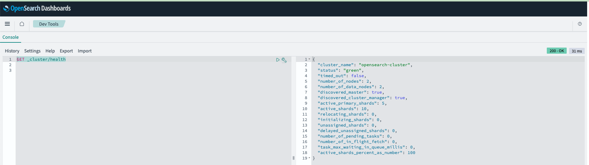

### Create a Virtual Environment [Optional]

Some environments can be managed externally by a system package manager, such as Homebrew in macOS. 

This means that your system may prevent you from installing packages globally to avoid conflicts with packages managed by the system package manager. This may pose an obstacle to package installation.

**To avoid this issue, you can Create a Virtual Environment before running python or pip commands.**

```bash
cd "<YOUR-INSTALLATION-PATH>"
```

#### on Linux/Mac/..

Install environment and activate the virtual environment.

```python
python3.11 -m venv myenv
```

```bash
source myenv/bin/activate
```

## Set Up Development OpenSearch Cluster

1. Create a directory for your OpenSearch cluster:

    ```shell
    mkdir opensearch-cluster
    cd opensearch-cluster
    ```

2. Create the Docker Compose file

    > In this directory, create `docker-compose.yml` and paste the development compose contents into it:

    ```shell
    wget -O docker-compose.yml https://raw.githubusercontent.com/oktytncy/open_search/main/manifests/docker-compose.yml
    ```

3. Install Docker Compose

    ```shell
    brew install docker-compose
    ```

4. Verify with the following command.

    ```
    docker ps --format "table {{.Names}}\t{{.Status}}\t{{.Ports}}"
    ```

    💡 Expected Output:
    ```shell
    (myenv) (base) oktay.tuncay@Oktay-Tuncay-H76R2P9W6H open_search % docker ps --format "table {{.Names}}\t{{.Status}}\t{{.Ports}}"

    NAMES                   STATUS         PORTS
    opensearch-dashboards   Up 2 minutes   0.0.0.0:5601->5601/tcp, [::]:5601->5601/tcp
    opensearch-node1        Up 2 minutes   0.0.0.0:9200->9200/tcp, [::]:9200->9200/tcp, 0.0.0.0:9600->9600/tcp, [::]:9600->9600/tcp
    opensearch-node2        Up 2 minutes   9200/tcp, 9300/tcp, 9600/tcp, 9650/tcp
    ```

4. Confirm OpenSearch responds.

    ```shell
    curl -s http://localhost:9200/ | head
    ```


Port 5601 is the default web UI port for OpenSearch Dashboards (and historically for Kibana, which OpenSearch Dashboards was forked from).

3. Access OpenSearch Dashboards

    > OpenSearch Dashboards is the web-based UI for OpenSearch. It runs on port **5601** by default (similar to Kibana).
    > 
    > Once the containers are running, open your browser and go to: http://localhost:5601

    > 📌 Conceptually:
    > 	- 9200 -> OpenSearch API
    > 		- Used by apps, curl, integrations
    > 		- REST/JSON interface
    > 	- 5601 -> OpenSearch Dashboards (Web UI)
    > 		- Used by humans in the browser
    > 		- Visualizations, dashboards, Dev Tools
    > So they’re intentionally separated:
    > 	- Machines -> 9200
    > 	- Humans -> 5601

    > You may see a popup about a new **Enhanced Discover experience**. This is optional and can be safely dismissed for local or development setups.

## OpenSearch Dashboards: Dev Tools + First API Calls

### Dev Tools: the **Console** inside Dashboards

> Go to **☰ Menu** -> Management -> Dev Tools

Dev Tools is basically **curl, but inside the UI**. You paste REST requests (GET/PUT/POST/DELETE) and see JSON responses.

1. Check your OpenSearch is healthy.

    ```console
    GET _cluster/health
    ```

    > ---
    > 👀 What to look for:
    > - status: green -> perfect
    > - status: yellow -> usually OK for local learning (often happens when replicas exist but you don’t have enough nodes)
    > - status: red -> something is wrong (don’t continue until fixed)
    >
    > ---

    <p align="middle">
    
    </p>

    > ---
    > 📌 Other useful commands:
    >   - See nodes:
    >       - GET _cat/nodes?v
    >   - See indices (tables)
    >       - GET _cat/indices?v
    > 
    > If this is a fresh setup, you might see few or no indices. That’s fine.
    >
    > ---

### Build a StreamFlix dataset (catalog + users + watch events)

> **Why this dataset**
> It lets you practice the most useful OpenSearch concepts in one story:
> - **Search titles like a user** (full-text search)
> - **Synonyms** (“sci-fi” ≈ “science fiction”, “romcom” ≈ “romantic comedy”)
> - **Autocomplete** (typing “orbi…” suggests “Orbital Heist”)
> - **Nested fields** (cast members with role + name matched together)
> - **Analytics** (top genres, watch time by device, watch activity over time)


#### Create the indexes

##### Titles index: search + synonyms + autocomplete + nested cast

First, lets design the `schema` and `text rules` for the movie/series catalog.

In OpenSearch, you don’t just dump JSON and hope for the best. You first decide:

1. What fields exist (title, description, genres, release_date, cast…)
2. How text should be understood (normal search, synonyms, autocomplete)
3. How arrays of objects should behave


##### Step 1: Create a basic Titles index (no synonyms, no autocomplete yet)

Let’s start simple and create an index that supports normal search + correct cast structure.

> Run the below script in Dev Tools:

```http
PUT streamflix_titles
{
  "settings": { "number_of_shards": 1, "number_of_replicas": 0 },
  "mappings": {
    "properties": {
      "title_id":     { "type": "keyword" },
      "title":        { "type": "text", "fields": { "keyword": { "type": "keyword" } } },
      "description":  { "type": "text" },
      "type":         { "type": "keyword" },
      "genres":       { "type": "keyword" },
      "release_date": { "type": "date" },
      "runtime_min":  { "type": "integer" },
      "rating":       { "type": "float" },
      "languages":    { "type": "keyword" },
      "cast": {
        "type": "nested",
        "properties": {
          "name": { "type": "text", "fields": { "keyword": { "type": "keyword" } } },
          "role": { "type": "keyword" }
        }
      }
    }
  }
}
```

✅ What you should see:

```http
"acknowledged": true
```

Then verify count:

```http
GET streamflix_titles/_count
```

<p align="middle">

</p>